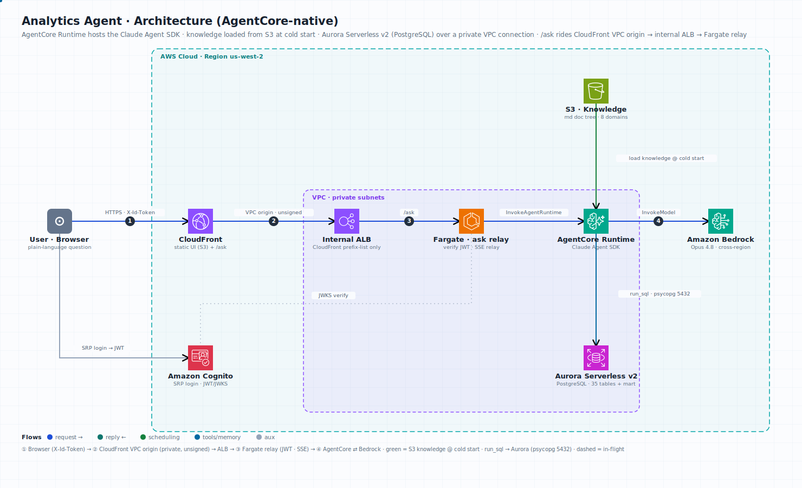

**English** | [中文](README.zh-CN.md)

# Analytics Agent · Progressive Disclosure

[](LICENSE)
[](backend/requirements.txt)
[](https://docs.anthropic.com)
[](https://aws.amazon.com/bedrock/)

An "ask-your-data" demo: ask in plain language, and the agent locates the right tables, writes correct SQL, runs it, and returns a chart plus a conclusion.

What it really sets out to prove is one thing: **turning a database schema into a "data dictionary" — a markdown doc tree the agent browses on demand, reading routes layer by layer before writing SQL — is more accurate and cheaper than stuffing the entire schema into the context window, or exploring the database from scratch on every question.** That mechanism is exactly the *progressive disclosure* idea behind Agent Skills.

The dataset is deliberately messy: a content + commerce app (think a social-shopping platform), with **35 tables across 8 business domains and ~190k rows** of synthetic data. The more tables there are, the more definitional traps appear (is GMV gross or net of refunds? is a coupon redemption recorded on the template table or the claim table? should an A/B test be time-boxed?) — and that's precisely where "read the right doc first, then write SQL" earns its keep.



> The diagram animates in the rendered README (GitHub embeds the SVG as an image). Blue = request in-flight, teal = the streamed reply, green = the knowledge tree synced from S3 at cold start, sky = `run_sql` hitting Aurora over the VPC. The `/ask` hop rides a CloudFront VPC origin to an internal ALB and a Fargate relay, which verifies the Cognito JWT and streams SSE from the AgentCore Runtime.

## What it looks like

The left rail has 6 example questions (easy to hard: 30-day GMV → subscription plans → conversion funnel → coupon redemption → channel CAC → A/B experiment). As the agent works, it streams "which doc am I reading right now" in real time, so you can watch progressive disclosure happen. The UI has an **EN / 中 language toggle** (top-right). The brain is an agent built on the **Claude Agent SDK**, running on **Amazon Bedrock** (default `global.anthropic.claude-opus-4-8`, cross-region inference via the `global.` prefix) — it does not depend on the Claude Code CLI. End to end, a question takes ~25–70s (Opus reads several docs and makes several tool round-trips). Note: the UI *chrome* toggles between English and Chinese, but the **analysis content** (insights, generated SQL, results) comes back in Chinese, because the knowledge base the agent reads is Chinese.

To run it locally see [Run locally](#run-locally); to deploy it into your own AWS account see [docs/deployment.md](docs/deployment.md).

> The README and this project's docs are English; the **knowledge base under `knowledge/` is kept in Chinese** (it is the agent's source of truth and matches the Chinese sample data). A full Chinese README is at [README.zh-CN.md](README.zh-CN.md).

## Three layers, one idea

The project is the same idea realized at three levels:

```
┌──────────────────────────────────────────────────────────────┐
│  3) Web App (the product)      backend/ + web/                │
│     Claude Agent SDK + Bedrock + FastAPI, with 5 MCP tools:   │
│     read_doc / run_sql / call_metric / compute_stats /        │
│     present_result — the frontend streams each step over SSE  │
├──────────────────────────────────────────────────────────────┤
│  2) Knowledge base (data dictionary + routing)   knowledge/   │
│     a markdown doc tree:  domains/_index.md   (L1 routing)    │
│       → domains/<domain>/_index.md            (L2 pick table) │
│       → domains/<domain>/<table>.md           (L3 fields)     │
│     + metrics/ (metric definitions) + relationships.md        │
├──────────────────────────────────────────────────────────────┤
│  1) Data layer (a reproducible sample DB)  database/ + data/  │
│     DDL for 8 domains + a Python data generator + 35 CSVs     │
│     loaded into PostgreSQL — 35 tables, ~190k rows            │
└──────────────────────────────────────────────────────────────┘
```

- **Data layer** is the foundation: DDL creates 35 tables, `scripts/generate_data.py` produces synthetic data exported to CSV, and Docker loads it on first start.
- **Knowledge base** is the core asset: the markdown doc tree under `knowledge/` *is* the data dictionary. The web app's `read_doc` tool reads it route by route, it is baked into the image, and it is the agent's only source of knowledge.
- **Web App** productizes all of it: a web tool anyone can open, visualizing the whole "read docs → write SQL → render chart" flow.

## Knowledge base (data dictionary)

`knowledge/` is the agent's single knowledge base — a markdown doc tree covering all 8 domains plus the governance (mart) layer:

- `domains/`: three-level routing (`_index.md` master index → per-domain index → per-table card). Table structure, column enums, and example SQL live here.
- `metrics/`: metric definitions. `governed_metrics.md` is the official governed definition, mapped one-to-one to the `call_metric` tool in `backend/metrics_def.py` (code is the source of truth for the definition).
- `analysis/`: SOPs for 5 in-depth analysis methods, with statistical formulas.
- `relationships.md`: join keys across tables.

See [knowledge/README.md](knowledge/README.md) for details. **The knowledge doc tree is kept in Chinese.**

> Early on this tree lived under `.claude/skills/` as a Claude Code CLI skill (there were even "shortcut-template" and "pure-routing" variants for comparison). After productization it was consolidated into a top-level `knowledge/`, and the CLI-skill variant was removed.

## Two paradigms: text-to-ETL and text-to-insight

The same data is modeled in two layers, so one demo tells two stories:

- **Raw data · querying (text-to-ETL)**: 35 raw detail tables. For fetch-style questions ("30-day GMV", "conversion funnel", "channel CAC"), the agent joins multiple tables on the fly, decides the definition itself, and writes complex SQL. The challenge is constructing the logic correctly and avoiding definitional traps.
- **Governance layer · insight (text-to-insight)**: on top of the raw tables, `database/09_mart.sql` builds 4 pre-aggregated "governed" tables (`mart_*`), where GMV / new users / attribution / repurchase definitions are **frozen** into the tables and into `metrics/governed_metrics.md`. For judgment-style questions ("review monthly GMV — what drove it?", "how's the business this week?", "repurchase rate"), the agent writes simple SELECTs against clean tables and spends its effort on slicing, attribution, and drawing conclusions.

This mirrors two real-world situations: before governance, AI turns messy data into the right numbers; after governance, the plumbing is done and AI helps you analyze, attribute, and judge. The left-rail presets are split into these two groups. How the agent chooses between the layers lives in the system prompt in `backend/agent.py` (fetching goes to raw domains; diagnosis / review / holistic judgment goes to the governance layer).

## Prerequisites

- **AWS account with Amazon Bedrock model access.** In the Bedrock console, request access to the model this sample uses (default: Claude Opus 4.8) in your Region. The sample calls it via the cross-region inference profile (`global.anthropic.claude-opus-4-8`).
- **AWS credentials** on the standard chain (`~/.aws`, environment variables, or an EC2 instance role).
- **Docker + Docker Compose** — for the database container (and the full cloud stack).
- **Python 3.11** — for the backend.
- **PostgreSQL 16** — only for the local (non-Docker) Web App path via `backend/run.sh`.
- **Node.js 20+ and the Claude Code CLI** — install with `npm install -g @anthropic-ai/claude-code`. The Claude Agent SDK launches the `claude` CLI as a subprocess, so it must be on your `PATH`. (The Docker image installs this for you; the local `run.sh` path needs it on your machine.)

> **Cost**: this is not free to run. Each question invokes Claude Opus on Amazon Bedrock (tens of seconds of reasoning plus several tool round-trips), and the cloud deployment additionally runs an EC2 instance and a CloudFront distribution — you pay standard Bedrock token and infrastructure charges. Tear the cloud resources down when you're done (see [Cleanup](#cleanup)).

## Run locally

**1. Start the local database** (Docker; first start auto-creates tables and loads data, ~30s):

```bash
docker compose up -d
docker compose logs -f db          # wait until loading completes
# verify:
docker compose exec db psql -U postgres -d app_analytics -c \
  "SELECT (SELECT count(*) FROM users) users, (SELECT count(*) FROM events) events, (SELECT count(*) FROM orders) orders;"
```

To poke at the data manually, use `scripts/dbquery.sh "SELECT ..."` (runs via `docker exec` into the local DB).

**2. Run the Web App** (Agent SDK + FastAPI + frontend):

```bash
# Prereqs: local Postgres@16 (brew), a Python venv, and usable Bedrock credentials
# (model access enabled in your target region)
cd backend
./run.sh                            # brings up local Postgres (5433) + uvicorn (8000)
# open http://127.0.0.1:8000/
```

> `backend/run.sh` assumes macOS (Apple Silicon) Homebrew Postgres at `/opt/homebrew/opt/postgresql@16/bin`. On Intel macOS or Linux, adjust `PGBIN` in the script (or use the Docker database from step 1 by pointing `PGHOST`/`PGPORT` at it).

Backend architecture, environment variables, and self-test commands are in [backend/README.md](backend/README.md).
If the backend is unreachable, `web/index.html` automatically falls back to an offline demo (built-in mock data) — you can even open the file directly to see the UI.

## Project structure

```
sample-analytics-agent-progressive-disclosure/
├── README.md                    # this file (English)
├── README.zh-CN.md              # Chinese README
├── PROJECT_STATUS.md            # evolution log (CLI Skill → Web App → cloud)
├── docs/deployment.md           # deployment guide (local + cloud)
├── docker-compose.yml           # local: database container only
├── docker-compose.cloud.yml     # cloud: database + FastAPI app (two containers)
│
├── database/                    # ① data layer · DDL
│   ├── 00_schema_overview.md
│   ├── 01-08_*_domain.sql        # DDL for 8 business domains (raw detail)
│   └── 09_mart.sql               # governance layer: 4 pre-aggregated tables (CTAS)
├── data/csv/                    # ① synthetic data (35 CSVs)
├── scripts/                     # ① data generator + load/query scripts
│   ├── generate_data.py · generators/
│   ├── docker-init.sh            # Docker first-start: create tables + load
│   └── dbquery.sh                # local data poking (docker exec)
│
├── knowledge/                   # ② knowledge base · data-dictionary doc tree (read by read_doc; kept in Chinese)
│   ├── README.md                 #   knowledge-base notes + single-source-of-truth rules
│   ├── domains/_index.md         #   3 levels: master index → domain index → table card
│   ├── domains/<domain>/<table>.md
│   ├── domains/mart/             #   governance layer: 4 table cards (text-to-insight)
│   ├── metrics/                  #   metric definitions (incl. governed_metrics.md)
│   ├── analysis/                 #   5 in-depth analysis SOPs + formulas
│   └── relationships.md          #   cross-table relationships
│
├── backend/                     # ③ Web App · the brain (Agent SDK + Bedrock)
│   ├── agent.py                  #   system prompt + event-stream parsing
│   ├── tools.py                  #   MCP tools: read_doc/run_sql/call_metric/compute_stats/present_result
│   ├── metrics_def.py · metric_layer.py · stats.py  # metrics-as-code + stats compute
│   ├── db.py                     #   read-only SQL safety boundary
│   ├── server.py                 #   FastAPI + SSE, serves the frontend
│   └── run.sh · Dockerfile · requirements.txt
└── web/index.html               # ③ Web App · frontend (progressive-disclosure UI, EN/中 toggle)
```

## Data overview

| Domain | Tables | Representative tables |
|--------|--------|-----------------------|
| User | 5 | users, user_profiles, user_devices, user_segments, user_segment_members |
| Behavior | 4 | events, sessions, page_views, event_definitions |
| Transaction | 4 | orders, order_items, payments, subscriptions |
| Product | 3 | products, categories, product_tags |
| Social | 6 | posts, post_likes, post_comments, post_shares, user_follows, user_messages |
| Marketing | 5 | campaigns, coupons, user_coupons, banners, push_notifications |
| Attribution | 5 | channels, ad_campaigns, ad_creatives, channel_daily_costs, user_attributions |
| Experiment | 3 | ab_tests, ab_test_variants, ab_test_assignments |

**35 tables / ~190k rows** in total. Full schema in [database/00_schema_overview.md](database/00_schema_overview.md).

On top of these 35 raw tables sits a **governed data mart**: 4 `mart_` pre-aggregated tables (`database/09_mart.sql`, derived from raw tables via CTAS, with frozen definitions), used for the "insight" questions — see [Two paradigms](#two-paradigms-text-to-etl-and-text-to-insight) above.

> **Note on time**: this is a static sample; the data falls between 2025-10-27 and 2026-01-24. For "last N days / recent" questions, anchor "today" to the `max()` of each table's own time column — **do not use `current_date` / `now()`** (they land outside the data range and return empty results). The web app's system prompt enforces this.

## What you can ask

User analysis (DAU/MAU, retention, profiles, segments), transaction analysis (GMV, average order value, conversion funnel, subscriptions), product analysis (sales ranking, category mix), social analysis (engagement, KOLs, follow graph), marketing analysis (campaign performance, coupon redemption, push), channel analysis (attribution, CAC, ROI), and experiment analysis (A/B variant comparison).

A difficulty-graded list of questions is in [test_questions.md](test_questions.md).

## Security

- **Read-only SQL boundary.** Every generated query passes through `backend/db.py`, which enforces a single read-only `SELECT`/`WITH` statement (forbidden-keyword guard, read-only connection, statement timeout, row cap).
- **Optional app-layer auth.** The cloud deployment puts Amazon Cognito in front (SRP login, JWKS verification); local development runs open by default (`AUTH_ENABLED` unset).
- **Static-analysis suppressions.** A small number of known false positives are suppressed inline (`# nosec` / `# nosemgrep`): the data generators use `random` for demo data (non-cryptographic), the metric compiler builds SQL from a trusted registry (filter values are escaped), and the frontend uses `innerHTML` to render app/model-generated content (echoed user text is HTML-escaped). All are reviewed false positives.

To report a security issue, follow the guidance in [CONTRIBUTING.md](CONTRIBUTING.md#security-issue-notifications) — please do **not** open a public GitHub issue.

## Cleanup

The local paths leave nothing running in AWS. For the **cloud** deployment, tear everything down when you're finished: terminate the EC2 instance, delete the security group / IAM instance profile+role / Cognito user pool / S3 bucket, and disable & delete the CloudFront distribution. Steps are in [docs/deployment.md](docs/deployment.md).

## License

This project is licensed under the MIT-0 (MIT No Attribution) License — see [LICENSE](LICENSE).
