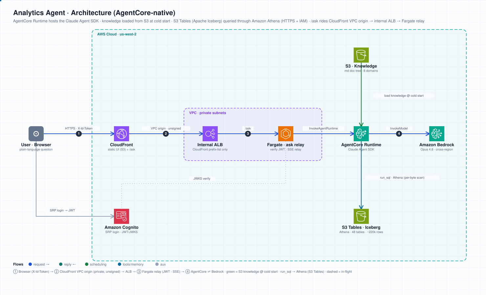

**English** | [中文](README.zh-CN.md)

# Analytics Agent · Progressive Disclosure

[](LICENSE)
[](backend/requirements.txt)
[](https://docs.anthropic.com)
[](https://aws.amazon.com/bedrock/)

An "ask-your-data" demo: ask in plain language, and the agent locates the right tables, writes correct SQL, runs it, and returns a chart plus a conclusion.

What it really sets out to prove is one thing: **turning a database schema into a "data dictionary" — a markdown doc tree the agent browses on demand, reading routes layer by layer before writing SQL — is more accurate and cheaper than stuffing the entire schema into the context window, or exploring the database from scratch on every question.** That mechanism is exactly the *progressive disclosure* idea behind Agent Skills.

The dataset is deliberately messy: a content + commerce app (think a social-shopping platform), with 35 raw tables across 8 business domains — plus a derived layer (dwd/dws/ads), a governed mart, and a couple of deliberately planted trap tables, **48 tables in the Glue Data Catalog, ~80M rows in the base tables**, hosted on **Amazon Redshift Serverless**. The more tables there are, the more definitional traps appear (is GMV gross or net of refunds? is a coupon redemption recorded on the template table or the claim table? should an A/B test be time-boxed?) — and that's precisely where "read the right doc first, then write SQL" earns its keep.



> The diagram animates in the rendered README (GitHub embeds the SVG as an image). Blue = request in-flight, teal = the streamed reply, green = the knowledge tree synced from S3 at cold start, sky = `run_sql` hitting Redshift Serverless via the Data API (HTTPS + IAM — no VPC connection, no connection pool, no password in the container). The `/ask` hop rides a CloudFront VPC origin to an internal ALB and a Fargate relay, which verifies the Cognito JWT and streams SSE from the AgentCore Runtime.

## What's new in v2 (Redshift + Glue)

v1 kept the data in a local/Aurora PostgreSQL (35 tables, ~190k rows) and the metadata in a hand-written markdown tree. v2 upgrades both ends — see [docs/architecture-v2-redshift-glue.md](docs/architecture-v2-redshift-glue.md) for the full story and the migration pitfalls:

- **Data**: moved to **Redshift Serverless** (~80M rows, queried via the Data API — HTTPS + IAM, `publiclyAccessible=false`, no inbound port). The generator (`scripts/gen/`) scales v1's data 427× while preserving every business ratio, so the definitional traps documented in the knowledge base still hold.
- **Metadata**: split into *declared* (`schema_manifest.yaml` + DDL, in git) / *actual* (**Glue Data Catalog**, generated, never hand-edited) / *semantic* (`knowledge/` table cards — when to use, caveats, metric definitions), with three-way reconciliation (`scripts/glue/reconcile.py`). On first run it caught 5 real doc drifts.
- **Governance pushed down into the warehouse**: a least-privilege `analytics_agent_ro` role (45 of 48 tables granted; the private-message table isn't granted at all) plus dynamic data masking on `users.email` / `users.phone` / `user_profiles.birth_date` — both enforced at query time, independent of the app-layer SQL guard.
- **The UI reads the catalog**: `GET /api/catalog` assembles Glue + Redshift `svv_*` + `knowledge/` + manifest into what the frontend renders, replacing numbers hard-coded in HTML.
- **Eval harness**: 21 golden-SQL cases pass 21/21 against Redshift (`eval/`); golden SQL stays in Postgres dialect and is rewritten at runtime (`scripts/gen/pg_to_redshift.py`).

The v1 PostgreSQL path (local Docker container) still runs but is **legacy — kept, not maintained**; see [docs/legacy.md](docs/legacy.md).

## What it looks like

The left rail has 6 example questions (easy to hard: 30-day GMV → subscription plans → conversion funnel → coupon redemption → channel CAC → A/B experiment). As the agent works, it streams "which doc am I reading right now" in real time, so you can watch progressive disclosure happen. The UI has an **EN / 中 language toggle** (top-right). The brain is an agent built on the **Claude Agent SDK**, running on **Amazon Bedrock** (default `global.anthropic.claude-opus-4-8`, cross-region inference via the `global.` prefix) — it does not depend on the Claude Code CLI. End to end, a question takes ~25–70s (Opus reads several docs and makes several tool round-trips). Note: the UI *chrome* toggles between English and Chinese, but the **analysis content** (insights, generated SQL, results) comes back in Chinese, because the knowledge base the agent reads is Chinese.

To run it locally see [Run locally](#run-locally); to deploy it into your own AWS account see [docs/deployment.md](docs/deployment.md).

> The README and this project's docs are English; the **knowledge base under `knowledge/` is kept in Chinese** (it is the agent's source of truth and matches the Chinese sample data). A full Chinese README is at [README.zh-CN.md](README.zh-CN.md).

## Three layers, one idea

The project is the same idea realized at three levels:

```
┌──────────────────────────────────────────────────────────────┐
│  3) Web App (the product)      backend/ + web/                │
│     Claude Agent SDK + Bedrock + FastAPI, with 5 MCP tools:   │
│     read_doc / run_sql / call_metric / compute_stats /        │
│     present_result — the frontend streams each step over SSE  │
├──────────────────────────────────────────────────────────────┤
│  2) Knowledge base (data dictionary + routing)   knowledge/   │
│     a markdown doc tree:  domains/_index.md   (L1 routing)    │
│       → domains/<domain>/_index.md            (L2 pick table) │
│       → domains/<domain>/<table>.md           (L3 fields)     │
│     + metrics/ (metric definitions) + relationships.md        │
├──────────────────────────────────────────────────────────────┤
│  1) Data layer (a reproducible warehouse)  database/ + scripts/│
│     Redshift Serverless — 48 tables in the Glue Data Catalog,  │
│     ~80M rows in the 35 base tables (generator: scripts/gen/)  │
│     (v1 local PostgreSQL path kept as legacy)                  │
└──────────────────────────────────────────────────────────────┘
```

- **Data layer** is the foundation: `database/redshift/` holds the v2 DDL (base + mart + derived + governance), `scripts/gen/` generates ~80M rows of Parquet and `scripts/redshift/load_from_s3.py` COPYies them in, `scripts/glue/` registers and reconciles the Glue Data Catalog.
- **Knowledge base** is the core asset: the markdown doc tree under `knowledge/` *is* the data dictionary. The web app's `read_doc` tool reads it route by route, it is baked into the image, and it is the agent's only source of knowledge.
- **Web App** productizes all of it: a web tool anyone can open, visualizing the whole "read docs → write SQL → render chart" flow.

## Knowledge base (data dictionary)

`knowledge/` is the agent's single knowledge base — a markdown doc tree covering all 8 domains plus the governance (mart) layer:

- `domains/`: three-level routing (`_index.md` master index → per-domain index → per-table card). Table structure, column enums, and example SQL live here.
- `metrics/`: metric definitions. `governed_metrics.md` is the official governed definition, mapped one-to-one to the `call_metric` tool in `backend/metrics_def.py` (code is the source of truth for the definition).
- `analysis/`: SOPs for 5 in-depth analysis methods, with statistical formulas.
- `relationships.md`: join keys across tables.

See [knowledge/README.md](knowledge/README.md) for details. **The knowledge doc tree is kept in Chinese.**

> Early on this tree lived under `.claude/skills/` as a Claude Code CLI skill (there were even "shortcut-template" and "pure-routing" variants for comparison). After productization it was consolidated into a top-level `knowledge/`, and the CLI-skill variant was removed.

## Two paradigms: text-to-ETL and text-to-insight

The same data is modeled in two layers, so one demo tells two stories:

- **Raw data · querying (text-to-ETL)**: 35 raw detail tables. For fetch-style questions ("30-day GMV", "conversion funnel", "channel CAC"), the agent joins multiple tables on the fly, decides the definition itself, and writes complex SQL. The challenge is constructing the logic correctly and avoiding definitional traps.
- **Governance layer · insight (text-to-insight)**: on top of the raw tables, `database/redshift/02_mart.sql` builds 4 pre-aggregated "governed" tables (`mart_*`), where GMV / new users / attribution / repurchase definitions are **frozen** into the tables and into `metrics/governed_metrics.md`. For judgment-style questions ("review monthly GMV — what drove it?", "how's the business this week?", "repurchase rate"), the agent writes simple SELECTs against clean tables and spends its effort on slicing, attribution, and drawing conclusions.

This mirrors two real-world situations: before governance, AI turns messy data into the right numbers; after governance, the plumbing is done and AI helps you analyze, attribute, and judge. The left-rail presets are split into these two groups. How the agent chooses between the layers lives in the system prompt in `backend/agent.py` (fetching goes to raw domains; diagnosis / review / holistic judgment goes to the governance layer).

## Prerequisites

- **AWS account with Amazon Bedrock model access.** In the Bedrock console, request access to the model this sample uses (default: Claude Opus 4.8) in your Region. The sample calls it via the cross-region inference profile (`global.anthropic.claude-opus-4-8`).
- **AWS credentials** on the standard chain (`~/.aws`, environment variables, or an EC2 instance role). The default (`redshift`) backend authenticates to the Data API with IAM — no database password on your machine.
- **A Redshift Serverless workgroup** loaded with the sample data — DDL in `database/redshift/`, generator and loading scripts in `scripts/gen/` + `scripts/redshift/` (default workgroup name `analytics-agent-wg`, 4 RPU base capacity; **do set a small base capacity and a monthly RPU usage limit** — the service default is 128 RPU).
- **Python 3.11** — for the backend.
- **Node.js 20+ and the Claude Code CLI** — install with `npm install -g @anthropic-ai/claude-code`. The Claude Agent SDK launches the `claude` CLI as a subprocess, so it must be on your `PATH`. (The Docker image installs this for you; the local `run.sh` path needs it on your machine.)
- *(Legacy v1 path only)* **Docker + Docker Compose** and/or **PostgreSQL 16** — for the local-container database (`DB_BACKEND=postgres`, see [docs/legacy.md](docs/legacy.md)).

> **Cost**: this is not free to run. Each question invokes Claude Opus on Amazon Bedrock (tens of seconds of reasoning plus several tool round-trips), and the cloud deployment additionally runs an EC2 instance and a CloudFront distribution — you pay standard Bedrock token and infrastructure charges. Tear the cloud resources down when you're done (see [Cleanup](#cleanup)).

## Run locally

The backend picks its data backend from `DB_BACKEND`: **`redshift` (default)** talks to Redshift Serverless via the Data API; `postgres` is the legacy v1 local container.

**Default path (Redshift):**

```bash
# Prereqs: a Python venv, usable AWS credentials (aws sso login / AWS_PROFILE),
# Bedrock model access, and a loaded Redshift Serverless workgroup (see database/redshift/)
cd backend
./run.sh                            # checks credentials, then starts uvicorn (8000)
# open http://127.0.0.1:8000/
```

`run.sh` derives the AWS account from `aws sts get-caller-identity` at startup — nothing account-specific lives in the repo. To override resource names (workgroup, Glue catalog, region), copy `.env.local.example` to `.env.local`. To poke at the warehouse manually, use `scripts/redshift/rsql.py "SELECT ..."`.

**Legacy path (v1 local Postgres, ~190k rows, not maintained):** `docker compose up -d` starts a database-only container (35 tables, auto-loaded CSVs), and `docker-compose.cloud.yml` runs the full v1 two-container stack with `DB_BACKEND=postgres` pinned. Details and the exact boundary of what is still maintained: [docs/legacy.md](docs/legacy.md).

Backend architecture, environment variables, and self-test commands are in [backend/README.md](backend/README.md).
If the backend is unreachable, `web/index.html` automatically falls back to an offline demo (built-in mock data, frozen at v1) — you can even open the file directly to see the UI. The full test suite is `bash scripts/test_all.sh` (layers L0–L6: reconciliation, consistency, eval, endpoint and render contracts — see [docs/test-plan-v2.md](docs/test-plan-v2.md)).

## Project structure

```
sample-analytics-agent-progressive-disclosure/
├── README.md                    # this file (English)
├── README.zh-CN.md              # Chinese README
├── PROJECT_STATUS.md            # evolution log (CLI Skill → Web App → EC2 → AgentCore → Redshift+Glue)
├── docs/
│   ├── architecture-v2-redshift-glue.md  # v2 architecture: what changed, why, and the pitfalls
│   ├── legacy.md                 # exactly which code is kept-but-not-maintained
│   ├── test-plan-v2.md           # L0–L8 acceptance layers (scripts/test_all.sh runs L0–L6)
│   └── deployment.md             # deployment guide
├── schema_manifest.yaml         # declared state of the derived layer (single source of truth)
│
├── database/                    # ① data layer · DDL
│   ├── redshift/                 #   v2 DDL: 01_tables / 02_mart / 03_derived / 04_governance
│   └── 0*_*.sql · 09_mart.sql    #   v1 PostgreSQL DDL (legacy, kept as record)
├── data/csv/                    # ① v1 seed data (35 CSVs, still used for dimension tables)
├── scripts/                     # ① generation / loading / verification toolchain
│   ├── gen/                      #   vectorized generator → Parquet (~80M rows, budget.py scales v1 ×427)
│   ├── redshift/                 #   rsql.py (Data API client) + load_from_s3.py (COPY)
│   ├── glue/                     #   register_catalog.py + reconcile.py (three-way drift check)
│   ├── audit/ · consistency/     #   data quality audit + migration-loss snapshot
│   ├── deploy/                   #   build_catalog_json.py + deploy_web.sh (frontend + metadata snapshot)
│   ├── ui/                       #   render contract tests (no browser needed)
│   └── test_all.sh               #   the whole gate: L0–L6
│
├── knowledge/                   # ② knowledge base · data-dictionary doc tree (read by read_doc; kept in Chinese)
│   ├── README.md                 #   knowledge-base notes + single-source-of-truth rules
│   ├── domains/_index.md         #   3 levels: master index → domain index → table card
│   ├── domains/<domain>/<table>.md
│   ├── domains/mart/             #   governance layer: 4 table cards (text-to-insight)
│   ├── metrics/                  #   metric definitions (incl. governed_metrics.md)
│   ├── analysis/                 #   5 in-depth analysis SOPs + formulas
│   └── relationships.md          #   cross-table relationships
│
├── eval/                        # ② eval harness: 21 golden-SQL cases + baselines (run_eval.py)
│
├── backend/                     # ③ Web App · the brain (Agent SDK + Bedrock)
│   ├── agent.py                  #   system prompt + event-stream parsing
│   ├── tools.py                  #   MCP tools: read_doc/run_sql/call_metric/compute_stats/present_result
│   ├── metrics_def.py · metric_layer.py · stats.py  # metrics-as-code + stats compute
│   ├── db.py                     #   read-only SQL safety boundary (DB_BACKEND: redshift | postgres)
│   ├── catalog.py                #   /api/catalog: Glue + svv_* + knowledge/ + manifest → UI metadata
│   ├── server.py                 #   FastAPI + SSE, serves the frontend
│   └── run.sh · Dockerfile · requirements.txt
├── web/index.html               # ③ Web App · frontend (progressive-disclosure UI, EN/中 toggle)
│
├── docker-compose.yml           # legacy v1: database container only
└── docker-compose.cloud.yml     # legacy v1: database + FastAPI app (two containers)
```

## Data overview

| Domain | Tables | Representative tables |
|--------|--------|-----------------------|
| User | 5 | users, user_profiles, user_devices, user_segments, user_segment_members |
| Behavior | 4 | events, sessions, page_views, event_definitions |
| Transaction | 4 | orders, order_items, payments, subscriptions |
| Product | 3 | products, categories, product_tags |
| Social | 6 | posts, post_likes, post_comments, post_shares, user_follows, user_messages |
| Marketing | 5 | campaigns, coupons, user_coupons, banners, push_notifications |
| Attribution | 5 | channels, ad_campaigns, ad_creatives, channel_daily_costs, user_attributions |
| Experiment | 3 | ab_tests, ab_test_variants, ab_test_assignments |

**35 base tables, ~80M rows** (largest: `post_likes` 15.2M, `page_views` 12.9M, `user_coupons` 9.7M, `events` 8.5M). The Glue Data Catalog holds **48 tables** in total once you add the governed mart (4 `mart_*` tables, definitions frozen — see [Two paradigms](#two-paradigms-text-to-etl-and-text-to-insight)), a derived layer (dwd/dws/ads), a `meta_snapshot` anchor table, and two deliberately planted trap tables (`orders_backup_20251201`, `tmp_campaign_roi_analysis` — visible in the catalog but not granted to the agent's role, to test whether it gets misled by stale copies).

The generator expresses scale as a multiple of the committed v1 seed data (`scripts/gen/budget.py`), so every business ratio — events per user, orders per user, the attribution coverage gap — survives the 427× scale-up, and the definitional traps described in `knowledge/` still hold. v1's full schema record: [database/00_schema_overview.md](database/00_schema_overview.md).

> **Note on time**: this is a static sample; the data falls between 2025-10-26 and 2026-01-24. For "last N days / recent" questions, anchor "today" to the `max()` of each table's own time column — **do not use `current_date` / `now()`** (they land outside the data range and return empty results). The web app's system prompt enforces this.

## What you can ask

User analysis (DAU/MAU, retention, profiles, segments), transaction analysis (GMV, average order value, conversion funnel, subscriptions), product analysis (sales ranking, category mix), social analysis (engagement, KOLs, follow graph), marketing analysis (campaign performance, coupon redemption, push), channel analysis (attribution, CAC, ROI), and experiment analysis (A/B variant comparison).

A difficulty-graded list of questions is in [test_questions.md](test_questions.md).

## Security

- **Read-only SQL boundary.** Every generated query passes through `backend/db.py`, which enforces a single read-only `SELECT`/`WITH` statement (forbidden-keyword guard, statement timeout, row cap). The boundary is backend-agnostic — switching `DB_BACKEND` does not weaken it.
- **Governance in the warehouse, two independent layers** (`database/redshift/04_governance.sql`). The SQL guard stops writes, but it cannot stop *reads made with too much authority*, so v2 adds data-layer controls that hold even if the app layer is bypassed: (1) a least-privilege `analytics_agent_ro` role with SELECT on only the tables it needs — the private-message table `user_messages` is not granted at all; (2) dynamic data masking on `users.email` / `users.phone` / `user_profiles.birth_date`, verified by querying as admin and getting `***@masked.invalid` back. Both act at query time. The governed surface is declared in `database/redshift/data_classification.yaml`: all 48 tables and 476 columns are reviewed, sensitive columns record an explicit treatment and rationale, and reconciliation fails when a new column is not registered or when declared DDM/GRANT state is missing. One measured caveat, documented rather than hidden: the Glue catalog is a *schema* projection, not a *permission* projection — ungranted tables still show up in table listings; the guarantee is "discovered ≠ readable", not invisibility.
- **No inbound database port.** The workgroup stays `publiclyAccessible=false`; all queries ride the Redshift Data API (HTTPS + IAM). No password is stored in the container — admin operations use a Secrets Manager-managed secret, and the agent runtime uses IAM temporary credentials.
- **Untrusted model output in the UI.** Model-generated text, SQL result column names, and DB cell values are all treated as untrusted and HTML-escaped (`esc()` in `web/index.html`) before reaching `innerHTML`. Column names matter here: a question can steer the agent into `SELECT 1 AS ""`, so headers are escaped exactly like cells.
- **Optional app-layer auth.** The cloud deployment puts Amazon Cognito in front (SRP login, JWKS verification); local development runs open by default (`AUTH_ENABLED` unset).
- **Static-analysis suppressions.** A small number of known false positives are suppressed inline (`# nosec` / `# nosemgrep`): the data generators use `random` for demo data (non-cryptographic), and the metric compiler builds SQL from a trusted registry (filter values are escaped). Both are reviewed false positives.

To report a security issue, follow the guidance in [CONTRIBUTING.md](CONTRIBUTING.md#security-issue-notifications) — please do **not** open a public GitHub issue.

## Cleanup

The default path runs against AWS resources you created, so tear them down when finished: delete the **Redshift Serverless workgroup and namespace**, the **Glue federated catalog**, and the S3 data bucket. Redshift Serverless bills only for RPU-seconds actually consumed (idle costs nothing), but set `base-capacity 4` and a monthly RPU usage limit anyway — the service default base capacity is 128 RPU. For the **cloud web deployment**, additionally tear down the AgentCore Runtime, the Fargate relay + ALB, the Cognito user pool, the site S3 bucket, and disable & delete the CloudFront distribution. Steps are in [docs/deployment.md](docs/deployment.md).

## License

This project is licensed under the MIT-0 (MIT No Attribution) License — see [LICENSE](LICENSE).
