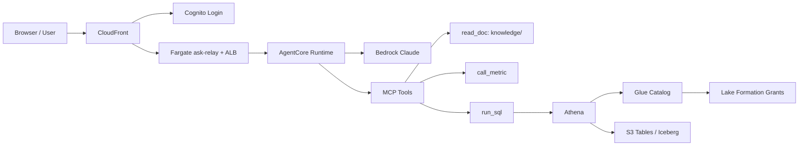
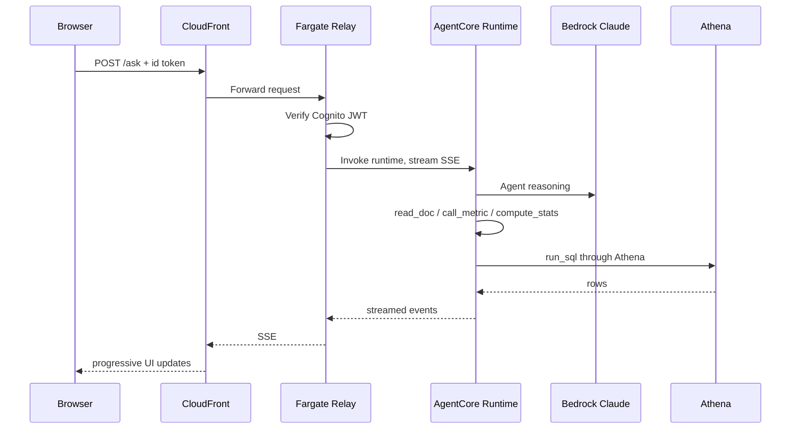
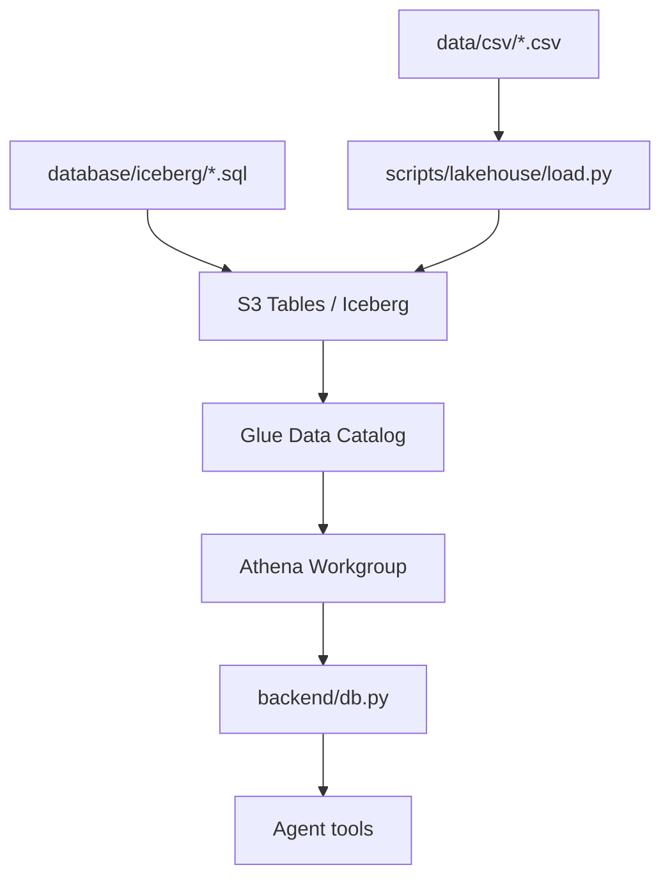
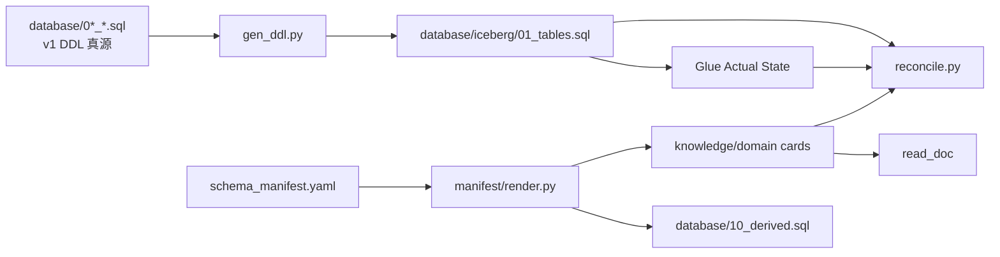
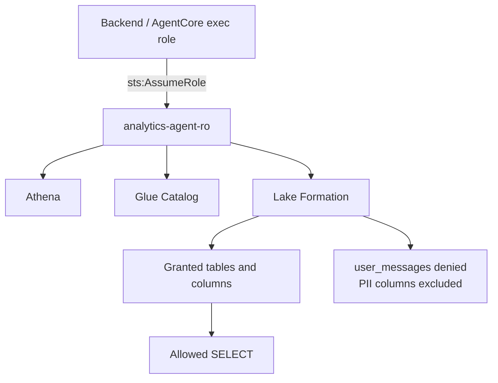

# AWS 云知识学习路径（结合本项目）

这份学习计划的目标不是“背完 AWS 服务列表”，而是让你能逐步看懂、讲清、排查并改动当前这个
`sample-analytics-agent-progressive-disclosure` 项目的云架构。

建议周期：8 周起步。每天 45-60 分钟，每周留 1 次 90 分钟做项目复盘或小实验。

---

## 0. 学习方法

每学一个服务，都用 5 个问题检查自己是否真的懂了：

1. **请求怎么走？** 从用户/脚本发起，到哪个 AWS API 或服务结束？
2. **数据在哪里？** 存储层、元数据层、查询层分别是什么？
3. **谁有权限？** 哪个 role、哪条 policy、谁 assume 谁？
4. **成本在哪里？** 是按请求、按扫描字节、按运行时长，还是按存储？
5. **坏了会怎样？** 会报错、超时、空结果，还是“看起来正常但答案错”？

这个项目最值得你训练的，就是第 5 点：很多云上问题不会响亮地失败，而是静默降级、查空、查错轴、用错身份。

---

## 1. 先建立项目全景

当前项目可以拆成 5 条主链路：



### 你最终要能讲清楚

- 浏览器提问后，为什么不是直接访问数据库？
- Agent 为什么必须先读 `knowledge/` 再写 SQL？
- Athena 查询为什么不需要数据库连接池和密码？
- `AGENT_ROLE_ARN` 设与不设有什么安全差异？
- 为什么 Lake Formation 这里是“列级排除”，不是“值级脱敏”？
- 为什么 `meta_snapshot.as_of_date` 比 `current_date` 或表自己的 `max(dt)` 更重要？
- 为什么 `analyticsagent/app/analytics/` 不能手改？

### 先给一版参考答案

**浏览器提问后，为什么不是直接访问数据库？**

因为浏览器是不可信环境，不能把数据库权限、AWS 凭证或查询能力直接暴露给用户。正确链路是：浏览器只把问题发给后端或中继，后端负责认证、调用 Agent、限制工具、校验 SQL，再用受控身份访问 Athena。这样可以把“用户能问什么”和“系统能查什么”隔离开。

**Agent 为什么必须先读 `knowledge/` 再写 SQL？**

因为模型不应该凭记忆猜表、猜字段、猜业务口径。这个项目的核心思想就是 progressive disclosure：先读总索引确定业务域，再读域索引确定表，最后读表卡片拿字段、枚举、陷阱和示例。这样模型每次只加载当前问题需要的知识，既省 token，也减少误用表和口径的概率。

**Athena 查询为什么不需要数据库连接池和密码？**

Athena 不是传统长连接数据库。它是一个托管查询服务，调用方式是 HTTPS API：提交 SQL、轮询状态、读取结果。鉴权靠 IAM 临时凭证，不靠数据库用户名密码，所以后端不需要维护连接池，也不用在容器里保存数据库密码。

**`AGENT_ROLE_ARN` 设与不设有什么安全差异？**

设了 `AGENT_ROLE_ARN` 时，后端会 assume 到专门的只读角色 `analytics-agent-ro`，再由 Lake Formation 控制它能读哪些表和列。不设时，后端通常用当前进程自己的 AWS 凭证，本地开发时很可能是 admin 权限，这时只有 `db.py` 的“只读 SQL”边界，缺少列级读权限边界。

**为什么 Lake Formation 这里是“列级排除”，不是“值级脱敏”？**

Redshift 有动态脱敏能力，可以让列还在，但值变成掩码。Lake Formation 没有同等的值级 masking 原语，所以这个项目采用列级授权：敏感列根本不授予 agent role。结果是 `SELECT *` 看不到这些列，显式写 `SELECT email` 会报 `COLUMN_NOT_FOUND`，而不是返回 `***@masked.invalid`。

**为什么 `meta_snapshot.as_of_date` 比 `current_date` 或表自己的 `max(dt)` 更重要？**

这是静态样本数据，业务上的“今天”固定在 `meta_snapshot.as_of_date`，而系统真实日期已经远远晚于数据范围。用 `current_date` 会查空；用每张表自己的 `max(dt)` 更危险，因为有些表的时间轴延伸到 2026-09-01，会让“近 30 天”落到没有真实业务成交的未来区间，返回看似合理但口径错误的数。

**为什么 `analyticsagent/app/analytics/` 不能手改？**

它是 AgentCore Runtime 的生成副本，不是源代码真源。源代码在 `backend/` 和 `scripts/lakehouse/athena.py`。如果手改云上副本，本地和云上会漂移，最坏情况是本地测试全绿、云上却继续用旧 prompt 或旧指标口径。正确做法是改源文件，然后运行 `scripts/deploy/sync_agent_code.py --apply`。

---

## 2. 阶段一：云基础补齐（第 1-2 周）

目标：能听懂架构图里的基础名词，并知道它们在项目里的位置。

### Week 1：身份、权限、存储

重点概念：

- IAM user / role / policy / trust policy
- STS AssumeRole
- S3 bucket / object / prefix / bucket policy
- CloudTrail：谁在什么时候调用了什么 API
- CloudWatch Logs：服务日志在哪里看

结合本项目要看的文件：

- `backend/db.py`
- `scripts/lakehouse/governance.py`
- `.env.local.example`
- `docs/deployment.md`

练习：

- 用自己的话解释 `AGENT_ROLE_ARN`。
- 画出“后端进程身份”和“查询数据身份”的区别。
- 找出项目里哪些地方会暴露有效身份，例如 `/health` 的 `identity`。

参考答案：

- `AGENT_ROLE_ARN` 是告诉后端“查数据时请切换到这个专门的最小权限角色”。它不是普通配置项，而是安全边界的入口。
- 后端进程身份负责运行服务、读配置、调用 AWS API；查询数据身份是 assume 后的 `analytics-agent-ro`，它才真正决定 Athena/Lake Formation 允许读什么。
- `/health` 的 `db.identity` 是最直接证据：如果它显示的是 `analytics-agent-ro` 的 ARN，说明后端查询身份接上了治理角色；如果为空或是执行角色自己，就要小心是否绕过了列级边界。

输出一页笔记：

```md
## IAM / AssumeRole

- 它解决的问题：
- 本项目中的例子：
- 如果配错会怎样：
- 我如何验证它真的生效：
```

### Week 2：网络、计算、前端入口

重点概念：

- VPC / subnet / security group
- ALB
- ECS / Fargate
- ECR container image
- CloudFront
- Cognito

结合本项目要看的文件：

- `infra/foundation.yaml`
- `infra/relay.yaml`
- `infra/edge.yaml`
- `functions/ask-relay/server.mjs`
- `backend/server.py`
- `web/index.html`

练习：

- 解释为什么静态页面能打开，不代表 `/ask` 一定可用。
- 解释为什么 Fargate relay 关掉后，CloudFront 页面仍然可能是 200。
- 解释 `X-Id-Token` / Cognito token 在请求链路里的作用。

参考答案：

- 静态页面由 CloudFront 从 S3 站点桶返回，和后端推理链路是两条不同路径。页面 200 只能说明前端资源可访问，不能说明 relay、AgentCore、Athena 都正常。
- Fargate relay 关掉后，CloudFront 仍然能服务 `index.html`、JS、CSS 等静态资源；只有 `POST /ask` 会因为 ALB 后面没有健康目标而失败。
- Cognito token 是用户登录后的身份证明。前端拿到 token 后随请求带上，中继或后端校验 token，确认“这个请求来自已登录用户”，再决定是否调用 AgentCore。

---

## 3. 阶段二：拆解当前项目架构（第 3-4 周）

目标：围绕项目本身建立“请求、数据、权限、元数据、评测”五张图。

### 3.1 请求链路



你要能说明：

- 哪一段负责鉴权？
- 哪一段负责模型推理？
- 哪一段负责 SQL 安全边界？
- 哪一段负责流式返回？

参考答案：

- **鉴权**：浏览器侧通过 Cognito 登录拿 token；云上 `/ask` 由 Fargate relay 校验 token，本地 FastAPI 模式由 `backend/server.py` 校验 Bearer token。静态资源本身不需要鉴权。
- **模型推理**：AgentCore Runtime 或本地 `backend/agent.py` 驱动 Claude Agent SDK，模型在 Bedrock 上推理。模型负责理解问题、决定读哪些文档、调用哪些工具。
- **SQL 安全边界**：`backend/db.py` 的 `validate()` 强制只允许单条 `SELECT` / `WITH`，拒绝写操作、多语句、危险关键字。这个边界管“不许写”。
- **流式返回**：Agent 产生的工具调用、SQL、结果、图表等事件通过 SSE 一路流回浏览器。前端不是等最终答案一次性返回，而是边读文档、边查数、边展示进度。

通俗理解：CloudFront 像门面，Cognito 像门禁，Relay 像前台核验身份，AgentCore 像分析师办公室，Bedrock 是分析师的大脑，Athena 是查数窗口，SSE 是分析过程的直播。

重点文件：

- `backend/server.py`
- `backend/agent.py`
- `backend/tools.py`
- `functions/ask-relay/server.mjs`

### 3.2 数据链路



你要能说明：

- 为什么 Iceberg 表在 S3 Tables 里，而查询通过 Athena？
- Glue 在这里是不是“真源”？答案：不是，它是实际态和验证点。
- 为什么 CSV 真源和 Athena 现查要做 `verify_load.py` 对账？

参考答案：

- **S3 Tables / Iceberg 是数据存储和表格式**：真实数据文件、表快照、元数据都在表桶里。**Athena 是查询执行层**：它读 Iceberg 元数据和数据文件，执行 SQL 并返回结果。
- **Glue 不是人工维护的真源**。本项目里真源分三类：DDL/manifest 是声明态真源，`knowledge/` 是语义真源，Glue 是云上实际建出来的目录状态。Glue 很重要，但它用于对账，不应该手工当源头改。
- **`verify_load.py` 是防止“看起来灌成功，实际少行/错列/精度丢失”**。CSV 是仓库里的种子数据真源，Athena 是运行时实际查询结果。两边逐表比行数、求和、时间边界，才能证明数据从 CSV 到 Iceberg 没有损耗。

一个好记的比喻：

- S3 Tables/Iceberg 是仓库货架。
- Glue Catalog 是货架目录。
- Athena 是拿目录去仓库取货并计算的人。
- CSV 是原始进货单。
- `verify_load.py` 是盘点。

重点文件：

- `scripts/lakehouse/setup.py`
- `scripts/lakehouse/load.py`
- `scripts/lakehouse/athena.py`
- `scripts/lakehouse/verify_load.py`

### 3.3 元数据与知识库链路



你要能说明：

- 表结构真源在哪里？
- 语义真源在哪里？
- 为什么 `verify_enums.py` 是必要的？
- 为什么 `verify_doc_sql.py` 只能证明 SQL 可解析，不能证明口径正确？

参考答案：

- **表结构真源**：35 张基表的源头是 `database/0[1-8]_*.sql`；现行 Iceberg DDL `database/iceberg/01_tables.sql` 是生成物，由 `gen_ddl.py --check` 防漂移。派生层由 `schema_manifest.yaml` 驱动生成。
- **语义真源**：`knowledge/`。这里写的是 agent 真正要读的业务解释：什么时候用这张表、什么时候不要用、字段枚举、常见陷阱、指标口径。
- **`verify_enums.py` 必要**：表名、列名都对，不代表列里的值对。比如知识卡片写事件名 `checkout`，但真实数据叫 `begin_checkout`，SQL 语法完全正确，结果却是 0。这类错只有比对“文档枚举值”和“数据实际值”才能发现。
- **`verify_doc_sql.py` 的边界**：它用 Athena `EXPLAIN` 证明 SQL 语法、表、列、类型能解析，但不执行业务逻辑，也不知道这个 SQL 的口径是否合理。独立计数的漏斗 SQL 可以 EXPLAIN 通过，但业务上不是正确漏斗。

一句话总结：`reconcile.py` 管表和列，`verify_doc_sql.py` 管示例 SQL 能不能解析，`verify_enums.py` 管列里的值有没有写错。三者缺一不可。

重点文件：

- `knowledge/README.md`
- `knowledge/domains/_index.md`
- `schema_manifest.yaml`
- `scripts/lakehouse/reconcile.py`
- `scripts/lakehouse/verify_enums.py`
- `scripts/lakehouse/verify_doc_sql.py`

### 3.4 权限链路



你要能说明：

- `db.validate()` 管“不许写”。
- Lake Formation / `analytics-agent-ro` 管“不许看”。
- 两条边界不能互相替代。
- 不设 `AGENT_ROLE_ARN` 时，本地通常是用开发者自己的权限查。

参考答案：

- `db.validate()` 是应用层 SQL guard。它看到的是 SQL 文本，能阻止 `DROP`、`INSERT`、多语句等写操作，但它不知道某个用户有没有权限读 `email`。
- Lake Formation 是数据权限边界。它决定 `analytics-agent-ro` 能读哪些表、哪些列。它能让 `user_messages` 整表不可读，也能让 `users.email` 这类列不可见。
- 两者不能互相替代：只有 Lake Formation 没有 SQL guard，模型如果能绕出写 SQL 就危险；只有 SQL guard 没有 Lake Formation，`SELECT email FROM users` 仍然是只读查询，会被放行。
- 本地不设 `AGENT_ROLE_ARN` 时，后端用的是当前 AWS 凭证。如果这是管理员凭证，就会绕过列级治理，所以本地演示不能天然等同于生产安全边界。

最短复述版：`db.py` 防破坏，Lake Formation 防越权读取。

重点文件：

- `backend/db.py`
- `scripts/lakehouse/governance.py`
- `docs/test-plan.md`

---

## 4. 阶段三：做小实验（第 5-6 周）

目标：通过小范围改动和验证，理解云架构的真实行为。

### 实验 1：Athena / Trino 方言

任务：

- 手写 10 条 Athena SQL。
- 每条都用 `meta_snapshot` 做时间锚点。
- 至少包含一次 `CAST`、一次 `interval '7' day`、一次 `date_trunc`、一次 `FILTER`。

命令参考：

```bash
backend/.venv/bin/python scripts/lakehouse/athena.py "SELECT count(*) FROM users"
```

学习点：

- Athena 是 API 查询，不是长连接数据库。
- Trino 方言和 Postgres 方言不同。
- `current_date` 语法对，但业务口径错。

参考答案：

你要练的是这类写法：

```sql
WITH a AS (
  SELECT max(as_of_date) AS d FROM meta_snapshot
)
SELECT
  CAST(event_time AS date) AS dt,
  count(DISTINCT user_id) AS dau
FROM events, a
WHERE CAST(event_time AS date) > a.d - interval '7' day
  AND CAST(event_time AS date) <= a.d
GROUP BY 1
ORDER BY 1;
```

这条 SQL 里有几个关键点：

- `WITH a` 先取全局业务日期锚点。
- `interval '7' day` 是 Trino 写法，不是 Postgres 的 `interval '7 days'`。
- `CAST(event_time AS date)` 是 Trino 写法，不用 `event_time::date`。
- 时间窗口有下界也有上界，避免把轴外数据算进去。

### 实验 2：知识卡片漂移

任务：

- 只读观察 `knowledge/domains/behavior/events.md`。
- 理解事件枚举为什么影响漏斗。
- 不实际改文件时，读懂 `verify_enums.py` 会抓什么。

命令参考：

```bash
backend/.venv/bin/python scripts/lakehouse/verify_enums.py
```

学习点：

- 表和列都对，不代表 WHERE 里的枚举值对。
- 错枚举常常不是报错，而是空结果。

参考答案：

假设文档写：

```sql
WHERE event_name = 'checkout'
```

但真实数据里事件名是：

```sql
begin_checkout
```

这时 Athena 不会报错，因为 `'checkout'` 只是一个合法字符串。它只会返回 0 行。对数据分析来说，这比报错更危险，因为用户可能会相信“没有人结算”。`verify_enums.py` 的价值就是提前发现这类“合法但永远查不到”的枚举漂移。

### 实验 3：官方指标 function call

任务：

- 读懂 `backend/metrics_def.py` 里一个指标定义。
- 读懂它如何被 `backend/metric_layer.py` 编译成 SQL。
- 解释为什么 GMV / CAC / ROI 这类指标优先走 `call_metric`。

命令参考：

```bash
backend/.venv/bin/python backend/metric_layer.py
```

学习点：

- 文档口径容易被模型忽略。
- 编成工具调用后，口径更容易被强制执行。

参考答案：

普通 text-to-SQL 是让模型现场写：

```sql
SELECT sum(actual_amount) FROM orders WHERE ...
```

但 GMV、CAC、ROI、退款这些指标有很多隐藏口径：订单状态、时间锚点、归因方式、成本轴是否 clamp、未归因怎么处理。只靠文档提醒，模型可能漏掉其中一条。

`call_metric` 的思路是把口径写进代码注册表：

- 指标名是什么。
- 查哪张 mart 表。
- 用哪个 SQL 表达式。
- 支持哪些维度。
- 时间窗口怎么编译。
- owner 和 version 是什么。

这样模型不是“重新发明 GMV”，而是调用已经冻结的官方口径。

### 实验 4：权限边界

任务：

- 跑治理层自测。
- 读懂哪些探针证明“读不到 PII”。
- 用自己的话解释“列级排除”和“值级脱敏”的差异。

命令参考：

```bash
backend/.venv/bin/python scripts/lakehouse/governance.py --selftest
backend/.venv/bin/python scripts/lakehouse/governance.py --verify
backend/.venv/bin/python scripts/lakehouse/governance.py --verify-backend
```

学习点：

- IAM 控制能不能调用服务。
- Lake Formation 控制能不能读表/列。
- `/health.identity` 是验证后端查询身份的关键证据。

参考答案：

你可以这样理解三层权限：

1. **执行角色**：服务本身用什么身份启动，能不能读 secret、能不能 assume 目标角色。
2. **查询角色 `analytics-agent-ro`**：真正拿去查 Athena 的身份。
3. **Lake Formation 授权**：这个查询角色在数据目录里能看哪些表和列。

如果只建了角色但后端没有 assume 它，治理没有生效。如果授权面看起来对，但查询身份还是 admin，也没有生效。`--verify-backend` 就是专门抓这个现实回归。

### 实验 5：测试分层

任务：

- 读 `docs/test-plan.md`。
- 跑 L0 静态自测。
- 解释每一层“唯一覆盖了什么”。

命令参考：

```bash
bash scripts/test_all.sh
```

学习点：

- 好的测试不是“很多”，而是每层有不可替代的覆盖面。
- L8 负测的价值是证明检查器真的会红。

参考答案：

可以这样记 L0-L8：

| 层 | 通俗理解 | 主要防什么 |
|---|---|---|
| L0 | 不上云的单元自测 | 代码生成器、SQL guard、工具白名单、同步器坏了 |
| L1 | 云资源在不在 | 表桶、namespace、workgroup、Glue federation 缺失 |
| L2 | 元数据是否一致 | DDL、Glue、knowledge、枚举、示例 SQL 漂移 |
| L3 | 数据是否灌对 | CSV 到 Athena 丢行、错列、精度损失 |
| L4 | 治理是否生效 | PII 列可见、拒绝表可读、后端没接受限角色 |
| L5 | 查询口径是否守住 | mart 口径、退款、GMV、CAC/ROI 等数值恒等式 |
| L6 | Web/API 契约 | `/health`、静态资源、页面挂载、SSE 基本契约 |
| L7 | 真实 Agent 评测 | 模型是否真的读文档、写对 SQL、答对金标 |
| L8 | 负测 | 检查器本身是不是摆设 |

L8 很重要，因为它会故意注入错误，看测试是否变红。如果注入了错误测试还绿，说明检查器名字比覆盖面大，是“假安全感”。

---

## 5. 阶段四：系统化补 AWS（第 7-8 周及以后）

目标：把项目经验上升成通用云架构能力。

### 学习顺序

1. AWS Cloud Practitioner 级别内容  
   目的：建立全局地图，知道服务大类和成本模型。

2. Solutions Architect Associate 级别内容  
   目的：系统学习高可用、网络、存储、权限、安全、成本。

3. AWS Well-Architected Framework  
   目的：学会用安全性、可靠性、性能效率、成本优化、运维卓越这些维度评审架构。

4. Analytics 专题  
   重点：S3、Athena、Glue、Lake Formation、Iceberg、数据目录、数据权限。

5. Serverless / Container 专题  
   重点：Lambda、ECS、Fargate、ALB、CloudFront、ECR、部署与日志。

6. AI on AWS 专题  
   重点：Bedrock、Agent Runtime、工具调用、安全边界、模型输出不可信、评测。

### 官方资源搜索关键词

为了避免链接失效，这里列资源名称和搜索关键词：

- `AWS Skill Builder Cloud Practitioner Essentials`
- `AWS Certified Cloud Practitioner exam guide`
- `AWS Certified Solutions Architect Associate exam guide`
- `AWS Well-Architected Framework`
- `Amazon Athena User Guide`
- `AWS Glue Data Catalog documentation`
- `AWS Lake Formation Developer Guide`
- `Amazon S3 Tables Iceberg documentation`
- `Amazon Bedrock User Guide`
- `Amazon ECS Fargate Developer Guide`
- `Amazon CloudFront Developer Guide`
- `Amazon Cognito Developer Guide`

---

## 6. 每周执行计划

| 周 | 主题 | 你要产出的东西 |
|---|---|---|
| Week 1 | IAM / STS / S3 / CloudTrail | 画出本项目权限链路，解释 `AGENT_ROLE_ARN` |
| Week 2 | VPC / ALB / Fargate / CloudFront / Cognito | 画出浏览器到 `/ask` 的请求链路 |
| Week 3 | S3 Tables / Glue / Athena | 画出 CSV 到 Athena 查询的数据链路 |
| Week 4 | knowledge / manifest / reconcile | 画出元数据三方对账链路 |
| Week 5 | Athena SQL + 指标层 | 手写 10 条 Trino SQL，解释 2 个 `call_metric` |
| Week 6 | 安全边界 + 测试分层 | 跑自测并写 L0-L6 每层作用 |
| Week 7 | Well-Architected 复盘 | 用 5 个维度评审当前项目 |
| Week 8 | 架构讲解演练 | 准备一份 10 分钟中文讲解稿 |

### 每周具体怎么学

#### Week 1：IAM / STS / S3 / CloudTrail

本周目标：搞懂“谁在用什么身份访问什么资源”。

你应该重点理解：

- IAM role 不是人，而是可被服务或人临时扮演的身份。
- Trust policy 决定“谁可以 assume 我”。
- Permission policy 决定“我 assume 成功后能做什么”。
- STS AssumeRole 会发临时凭证。
- CloudTrail 能查到 AssumeRole 和 Athena/Glue/S3 等 API 调用记录。

结合本项目的答案：

```text
后端启动时本来有一个执行身份，但这个身份不应该直接拥有完整数据权限。
当 AGENT_ROLE_ARN 存在时，backend/db.py 会 assume 到 analytics-agent-ro。
真正查 Athena 的是 analytics-agent-ro，而 Lake Formation 对这个角色做列级授权。
因此 user_messages 查不到，users.email / phone 等列也不可见。
```

本周产出：

- 一张权限链路图。
- 一段 3 分钟说明：`AGENT_ROLE_ARN` 为什么是安全边界，不只是配置项。

#### Week 2：VPC / ALB / Fargate / CloudFront / Cognito

本周目标：搞懂“浏览器请求怎么到后端”。

你应该重点理解：

- CloudFront 可以同时服务静态资源和转发 API 请求。
- Cognito 负责用户登录和 token。
- Fargate relay 是中继，不是模型本体。
- ALB 把请求转给 Fargate task。
- 前端页面能打开，只代表静态资源正常，不代表 `/ask` 正常。

结合本项目的答案：

```text
用户打开页面时，CloudFront 从 S3 站点桶返回 index.html。
用户提问时，请求走 POST /ask，经 CloudFront 转给 Fargate relay。
relay 校验 Cognito token，然后调用 AgentCore Runtime。
所以静态页面 200 和问答链路可用是两件事。
```

本周产出：

- 一张浏览器到 `/ask` 的请求链路图。
- 一段解释：为什么 relay desiredCount=0 时页面还能打开但提问失败。

#### Week 3：S3 Tables / Glue / Athena

本周目标：搞懂“数据在哪里，SQL 怎么查”。

你应该重点理解：

- S3 Tables/Iceberg 是数据表的存储和表格式。
- Glue Catalog 是目录，保存表名、列、类型、注释等元数据。
- Athena 是查询引擎，通过 API 执行 SQL。
- Athena 按扫描字节计费，不是按连接时长计费。

结合本项目的答案：

```text
CSV 种子数据通过 scripts/lakehouse/load.py 装载进 S3 Tables。
表桶联邦到 Glue 后，Athena 可以通过 Glue Catalog 找到表。
backend/db.py 不连接数据库主机，而是调用 scripts/lakehouse/athena.py 发 Athena API。
```

本周产出：

- 一张 CSV → S3 Tables → Glue → Athena → backend 的数据链路图。
- 手写 3 条 Athena SQL，并说明每条用了哪个时间锚点。

#### Week 4：knowledge / manifest / reconcile

本周目标：搞懂“为什么这个项目不让模型直接看全库 schema”。

你应该重点理解：

- `knowledge/` 是 agent 的数据字典。
- `domains/_index.md` 做一级路由。
- 域索引做二级路由。
- 表卡片提供字段、枚举、陷阱、示例。
- `reconcile.py`、`verify_enums.py`、`verify_doc_sql.py` 负责防文档腐烂。

结合本项目的答案：

```text
Glue 只能告诉我们表和列存在，不会告诉 agent 什么时候该用、什么时候别用。
这些业务语义写在 knowledge/ 里。
Agent 每次先读文档再写 SQL，是为了减少猜字段和猜口径。
```

本周产出：

- 一张 DDL / Glue / knowledge 三方关系图。
- 举一个“表列都对但业务结果错”的例子，例如事件枚举写错导致漏斗为 0。

#### Week 5：Athena SQL + 指标层

本周目标：能看懂 `call_metric` 为什么比手写 SQL 稳。

你应该重点理解：

- Trino 方言和 Postgres 方言差异。
- `meta_snapshot` 是全局业务日历。
- `metrics_def.py` 是指标注册表。
- `metric_layer.py` 把指标调用编译成 SQL。
- `call_metric` 返回的不只是数，还有 owner、version、口径声明。

结合本项目的答案：

```text
问 GMV / CAC / ROI 时，如果让模型每次手写 SQL，它可能漏掉状态过滤、时间上界、未归因说明或成本轴 clamp。
call_metric 把这些口径写进代码，让模型只能调用冻结后的定义。
```

本周产出：

- 解释 2 个指标，例如 `gmv_by_channel` 和 `cac`。
- 各写出它们为什么容易被模型手写错。

#### Week 6：安全边界 + 测试分层

本周目标：知道每层测试为什么存在。

你应该重点理解：

- `db.py` 是 SQL 写保护。
- `agent.py --selftest` 是工具白名单保护。
- `governance.py` 是读权限保护。
- `sync_agent_code.py --check` 防云上副本漂移。
- L8 负测证明检查器不是摆设。

结合本项目的答案：

```text
这个项目不是只防 SQL 写错，也防 agent 绕过工具、防文档漂移、防云上本地口径不一致、防治理接了但没真正使用。
测试分层的意义是：每一层盯一种独有失败模式。
```

本周产出：

- 用自己的话写 L0-L6 每层防什么。
- 跑一次 `bash scripts/test_all.sh`，记录成功/失败和原因。

#### Week 7：Well-Architected 复盘

本周目标：用 AWS 架构视角看项目，而不只是看代码。

可以按 5 个维度复盘：

- **Security**：Cognito、IAM、AssumeRole、Lake Formation、SQL guard、工具白名单。
- **Reliability**：`/health` 三态、SSE heartbeat、AgentCore 冷启动硬失败、测试分层。
- **Operational Excellence**：CloudWatch logs、CloudTrail、L0-L8、部署后复验清单。
- **Performance Efficiency**：Athena 按需查询、AgentCore warm client、CloudFront 静态资源缓存。
- **Cost Optimization**：Athena 按扫描字节、Fargate relay 可 desiredCount=0、AgentCore 闲置不按小时烧钱。

本周产出：

- 写一页“当前架构优点和风险”。
- 每个维度至少写 2 个项目里的具体例子。

#### Week 8：架构讲解演练

本周目标：能对别人讲清楚这个项目。

你要准备：

- 1 分钟：项目解决什么问题。
- 2 分钟：请求链路。
- 2 分钟：数据链路。
- 2 分钟：权限和安全边界。
- 2 分钟：为什么 progressive disclosure 有价值。
- 1 分钟：测试和部署怎么保证不漂移。

练习要求：

- 不要只念服务名，要讲“为什么需要它”。
- 每个 AWS 服务都要落回项目里的文件或脚本。
- 尽量用“失败会怎样”来说明设计价值。

---

## 7. 你可以直接照着写的周报模板

````md
## 本周学习主题

例如：IAM AssumeRole 与 Lake Formation 列级授权

## 我学到的 3 个概念

1.
2.
3.

## 它们在本项目里的位置

- 相关文件：
- 请求/数据/权限链路：
- 如果配错会怎样：

## 我做过的验证

```bash
# command here
```

## 还没完全理解的问题

- 

## 下周计划

-
````

### 示例周报：Week 1

````md
## 本周学习主题

IAM AssumeRole 与 Lake Formation 列级授权。

## 我学到的 3 个概念

1. IAM role 是可以被服务或用户临时扮演的身份，不是固定用户。
2. Trust policy 决定谁能 assume 这个 role，permission policy 决定 assume 后能做什么。
3. Lake Formation 可以在 Glue Catalog 层控制表和列的读取权限。

## 它们在本项目里的位置

- 相关文件：`backend/db.py`、`scripts/lakehouse/governance.py`、`.env.local.example`
- 请求/数据/权限链路：后端读取 `AGENT_ROLE_ARN`，通过 STS assume 到 `analytics-agent-ro`，再用这个身份调用 Athena。Lake Formation 决定这个角色能看到哪些表和列。
- 如果配错会怎样：如果没有设置 `AGENT_ROLE_ARN`，后端可能用开发者 admin 权限查数，PII 列也可能可见；如果 role trust policy 错，后端启动或 `/health` 会报 assume 失败。

## 我做过的验证

```bash
backend/.venv/bin/python scripts/lakehouse/governance.py --selftest
backend/.venv/bin/python scripts/lakehouse/governance.py --verify-backend
```

## 还没完全理解的问题

- Lake Formation 的 grant 和 IAM policy 在错误提示上分别长什么样？
- CloudTrail 里如何快速定位某次 AssumeRole？

## 下周计划

- 学习 CloudFront / Cognito / Fargate relay 请求链路。
````

### 示例周报：Week 4

````md
## 本周学习主题

Progressive disclosure 知识库与三方元数据对账。

## 我学到的 3 个概念

1. Glue Catalog 是实际态，不是人工维护真源。
2. `knowledge/` 是 agent 的语义真源，包含表什么时候用、什么时候不要用。
3. `verify_enums.py` 能发现表列都正确但枚举值错误的问题。

## 它们在本项目里的位置

- 相关文件：`knowledge/domains/_index.md`、`scripts/lakehouse/reconcile.py`、`scripts/lakehouse/verify_enums.py`
- 请求/数据/权限链路：Agent 通过 `read_doc` 逐层读取知识树，然后才调用 `run_sql`。Glue 和 knowledge 会被 reconcile 脚本对账。
- 如果配错会怎样：如果文档写了不存在的枚举值，SQL 不会报错，只会返回空结果，Agent 可能得出“没有用户做这个动作”的错误结论。

## 我做过的验证

```bash
backend/.venv/bin/python scripts/lakehouse/verify_enums.py
backend/.venv/bin/python scripts/lakehouse/verify_doc_sql.py
```

## 还没完全理解的问题

- `verify_doc_sql.py` 能 EXPLAIN 通过但口径仍然错误的例子还有哪些？

## 下周计划

- 学习 `call_metric` 和指标注册表。
````

---

## 8. 项目内常用命令

语法检查：

```bash
backend/.venv/bin/python -m compileall -q backend
```

只读 SQL guard 自测：

```bash
backend/.venv/bin/python backend/db.py
```

Agent 工具边界自测：

```bash
backend/.venv/bin/python backend/agent.py --selftest
```

云上副本同步检查：

```bash
backend/.venv/bin/python scripts/deploy/sync_agent_code.py --check
```

湖仓基础检查：

```bash
backend/.venv/bin/python scripts/lakehouse/setup.py --verify
```

元数据对账：

```bash
backend/.venv/bin/python scripts/lakehouse/reconcile.py --strict
backend/.venv/bin/python scripts/lakehouse/verify_enums.py
backend/.venv/bin/python scripts/lakehouse/verify_doc_sql.py
```

完整本地测试：

```bash
bash scripts/test_all.sh
```

追加负测：

```bash
bash scripts/test_all.sh --l8
```

---

## 9. 学习时不要踩的坑

- 不要从 Redshift 路径学现行架构：`database/redshift/`、`scripts/redshift/`、`scripts/glue/` 是历史路径。
- 不要把 Lake Formation 列级排除说成 masking。这里不是值变成 `***`，而是列不可见。
- 不要用 `current_date` 理解这个静态样本，应该用 `meta_snapshot.as_of_date`。
- 不要手改 `analyticsagent/app/analytics/` 里的生成副本。
- 不要只看“页面能打开”，还要看 `/ask`、`/health`、identity 和实际 SSE。
- 不要把 `db.py` 的只读边界当成数据权限边界，它只管“不许写”，不管“不许看”。
- 不要把测试通过率当成全部事实，要看每层测试覆盖了什么、没覆盖什么。

---

## 10. 最终验收：你应该能讲出的 10 分钟版本

到第 8 周，你应该能不用看稿讲清楚：

1. 这个项目为什么叫 progressive disclosure。
2. Agent 为什么先读 `knowledge/` 再写 SQL。
3. 数据为什么从 Redshift 迁到 Athena + S3 Tables。
4. Glue、manifest、knowledge 三方分别代表什么。
5. Athena 查询为什么没有数据库密码和连接池。
6. `call_metric` 为什么比让模型手写指标 SQL 更稳。
7. `db.validate()` 和 Lake Formation 分别保护什么。
8. Cognito、CloudFront、Fargate relay、AgentCore 各自的位置。
9. 为什么很多错误表现为空结果或静默降级，而不是异常。
10. 你会如何验证一次云上部署真的生效。

如果这 10 点都能讲清楚，你就已经不是“会背 AWS 服务”的初学者了，而是在用真实项目理解云架构。

### 10 分钟讲解稿参考

下面是一份可以直接练习的讲稿。

**第 1 分钟：项目是什么**

这个项目是一个“问数 Agent”demo。用户用自然语言提问，Agent 会先读数据字典，再写 SQL 查询 Athena，最后返回图表和结论。它要证明的核心观点是：不要把全库 schema 一次性塞给模型，也不要让模型每次从零探索数据库，而是把数据库知识组织成一棵 Markdown 文档树，让 Agent 按需逐层读取。这就是 progressive disclosure。

**第 2-3 分钟：请求链路**

浏览器打开的是 CloudFront 上的前端页面。用户登录通过 Cognito，拿到 token。用户提问时，请求走 `/ask`，云上由 CloudFront 转给 Fargate relay。relay 校验 token，再调用 AgentCore Runtime。Runtime 里运行 Claude Agent SDK，模型在 Bedrock 上推理。Agent 的工具只有几类：读文档、查 SQL、调用官方指标、算统计量、提交结果。结果通过 SSE 流式返回，所以前端能实时展示“正在读哪个文档、正在跑哪条 SQL”。

**第 4-5 分钟：数据链路**

数据层现在是 Athena + S3 Tables/Iceberg + Glue。CSV 种子数据通过 `scripts/lakehouse/load.py` 装进 S3 Tables。S3 Tables 保存 Iceberg 表和数据文件，Glue Catalog 保存表和列的目录信息，Athena 负责执行 SQL。后端不是连接一个数据库主机，而是通过 Athena API 提交查询，所以没有数据库密码和连接池。Athena 的成本主要来自扫描字节。

**第 6 分钟：知识库和元数据**

这个项目不是让模型凭记忆写 SQL。`knowledge/` 是它的语义真源。Agent 每次先读 `domains/_index.md` 找业务域，再读域索引找表，再读表卡片拿字段、枚举和陷阱。为了防止文档腐烂，项目有三类检查：`reconcile.py` 比 DDL、Glue、knowledge 的表和列；`verify_doc_sql.py` 检查文档里的 SQL 能不能被 Athena 解析；`verify_enums.py` 检查文档写的枚举值和真实数据是否一致。

**第 7 分钟：权限和安全边界**

安全边界有几层。第一层是工具白名单，Agent 只能调分析工具，不能随便 Bash、Read、Write。第二层是 `backend/db.py` 的 SQL guard，只允许单条只读 `SELECT` / `WITH`，防止写操作。第三层是 `AGENT_ROLE_ARN` 和 Lake Formation：后端 assume 到 `analytics-agent-ro`，由 Lake Formation 控制它能读哪些表和列。这里要注意，Lake Formation 是列级排除，不是值级 masking。敏感列不可见，而不是显示成掩码。

**第 8 分钟：为什么时间锚点重要**

这个数据集是静态样本，业务上的今天固定在 `meta_snapshot.as_of_date`。不能用系统的 `current_date`，因为会落到数据范围外。也不能用每张表自己的 `max(dt)`，因为有些表的时间轴比业务日历长很多，比如成本表到 2026-09-01。用错锚点不会报错，但会查到完全错误的窗口，结论可能反过来。

**第 9 分钟：为什么有 `call_metric`**

GMV、CAC、ROI、退款这些指标不是简单 SUM，一般都有状态过滤、时间窗口、归因口径、成本轴等细节。只写在文档里，模型可能忽略。这个项目把官方指标编成 `call_metric` 工具，口径在 `metrics_def.py` 注册，由 `metric_layer.py` 编译 SQL。这样模型调用的是冻结口径，结果还带 owner、version 和口径声明。

**第 10 分钟：如何验证部署真的生效**

我不会只看页面能不能打开。页面能打开只说明静态资源正常。我要看 `/health`，确认 dataLayer、region、engine 和 identity；看 CloudTrail，确认 Runtime 或后端确实 assume 到 `analytics-agent-ro`；跑 `sync_agent_code.py --check`，确认云上副本没有和 `backend/` 漂移；跑治理探针，确认 PII 列不可见；最后用几条已知问题复验，比如退款总额、渠道 GMV、漏斗和留存，确认本地和云上口径一致。

### 10 个验收问题的参考短答案

1. **为什么叫 progressive disclosure？**  
   因为 Agent 不一次性加载全库信息，而是按问题逐层读取需要的知识：总索引、域索引、表卡片、指标和关系。

2. **为什么先读 `knowledge/` 再写 SQL？**  
   因为表结构、枚举、业务陷阱都在文档里。先读可以减少猜字段、猜口径、用错表。

3. **为什么从 Redshift 迁到 Athena + S3 Tables？**  
   为了减少数仓容量和连接形态的复杂度。Athena 通过 API 查询 S3 Tables/Iceberg，按扫描字节计费，没有常驻数据库连接和密码。

4. **Glue、manifest、knowledge 分别是什么？**  
   Glue 是云上实际目录状态；manifest/DDL 是声明态真源；knowledge 是给 Agent 读的语义真源。

5. **Athena 为什么没有数据库密码和连接池？**  
   因为它是 AWS API 服务，鉴权靠 IAM 临时凭证。查询是提交、轮询、取结果，不是持久 TCP 数据库连接。

6. **`call_metric` 为什么更稳？**  
   因为它把指标口径写进代码注册表，模型只能调用冻结定义，不需要每次现场重写复杂 SQL。

7. **`db.validate()` 和 Lake Formation 分别保护什么？**  
   `db.validate()` 防写操作，Lake Formation 防越权读表/列。一个管“不许写”，一个管“不许看”。

8. **Cognito、CloudFront、Fargate relay、AgentCore 各自的位置？**  
   Cognito 做登录，CloudFront 服务前端并转发 `/ask`，Fargate relay 校验 token 并中继请求，AgentCore 运行 Agent。

9. **为什么很多错误不是异常？**  
   因为错误枚举、错误时间锚点、错误口径在 SQL 层都可能合法，只是返回空结果或错窗口，所以必须靠对账和评测抓。

10. **如何验证云上部署生效？**  
    看 `/health.identity`、CloudTrail AssumeRole、同步检查、治理探针、关键指标复验、本地云上 SQL/结果一致性。
