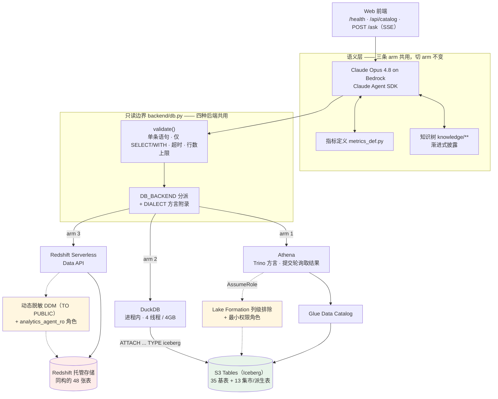
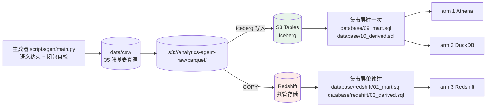
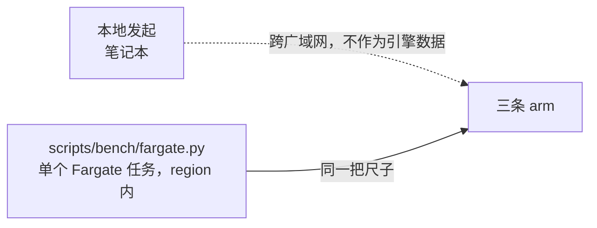

# 三种架构对比：架构图

日期：2026-09-03

对比的前提是**语义层完全不变，只换计算与存储**。知识树、指标定义、题目、判据在三条 arm 上逐字相同，因此测出来的差异归属于引擎，不归属于提示词。

## 一、总览



图中三处关键事实：

1. **arm 1 与 arm 2 共享同一份物理 Parquet 文件**，不是各存一份内容相同的数据。两条 arm 的任何数值差异只能来自引擎。
2. **arm 3 需要额外物化一份数据**。`COPY` 读不了 Iceberg，Redshift 读的是 `s3://analytics-agent-raw/parquet/` 的独立拷贝。这次拷贝本身是对比结论的一部分，不是实现上的将就。
3. **arm 1 与 arm 3 各有一套列级治理，两套原语不同；arm 2 没有。**

   | | arm 1 athena | arm 3 redshift |
   |---|---|---|
   | 原语 | Lake Formation 列级排除 | 动态脱敏 DDM + 角色级 GRANT |
   | `SELECT email` | 报列不存在 | 返回 `***@masked.invalid` |
   | `phone` | 不在授权面里 | `151****0906` |
   | `birth_date` | 不在授权面里 | `1971-01-01`，只剩出生年 |
   | 生效对象 | 指定的最小权限角色 | `TO PUBLIC`，不区分谁连进来 |
   | 整表不授权 | `user_messages` | `user_messages`（45 张表有 SELECT） |

   arm 3 的脱敏对 superuser 同样生效，实测确认。这一点是治理层最有说服力的地方：不是约束模型不去查 PII，而是查了也拿不到明文。

   两套原语对 agent 的表现不同，这本身是对比结论的一部分。列级排除的表现是「这张表没有这列」，动态脱敏的表现是「这列查得到，但没有明文」。前者让错误在写 SQL 时就暴露，后者让分析可以照常做下去（生日保留年份，年龄段分析不受影响）。

   arm 3 有一处尚未接线，说结论时要带上：治理层是两层，`TO PUBLIC` 的脱敏对所有访问者生效，已经落到 agent 身上；表级授权面已经定义好，但后端走的是调用者自己的 IAM 身份，没有切到 `analytics_agent_ro`，所以 `user_messages` 在这条 arm 上目前仍然查得到。arm 1 是靠 `AGENT_ROLE_ARN` 做 AssumeRole 才把这一层接上的，arm 3 对应的接线是一个独立步骤。

   arm 2 是第三种情况，而且比「粒度粗」更彻底：DuckDB 引擎内部一条治理原语都没有，没有用户、角色、`GRANT`、masking policy，也没有行列级安全。它是嵌入式库，没有权限分离的概念，边界完全由它手里那份凭证决定。这条 arm 走 `PROVIDER credential_chain` 拿 IAM 凭证直接 `ATTACH` S3 Tables，而 IAM 对 S3 Tables 的动作粒度是命名空间和表，没有列这一级。表级既是下限也是上限。

   由此得到一条对比结论：**DuckDB 直读 Iceberg 会绕过 Lake Formation 的列级排除。**arm 1 的列级治理是 Athena 作为 LF 集成引擎在查询时执行的，执行点在引擎里；DuckDB 不与 LF 集成，拿到 `s3tables:GetTableData` 之后读的是底层 Parquet，策略在这条路径上没有执行点。含义是「LF 上配了列级排除」不等于「这一列在任何客户端都读不到」。

   这与仓库里已有的另一条结论同源：此前实测发现挂了脱敏的表在 Glue 目录里照常出现、列名都在，结论是 Glue federated catalog 是 schema 投影而非权限投影。本条是它的姊妹结论 —— Iceberg 表的物理文件也不是权限投影。

   这条结论目前是从架构推出的，尚未实测。坐实的方法是用 arm 1 的最小权限角色凭证去跑 DuckDB，看 `SELECT email FROM users` 返回明文还是被 IAM 拦住。

   要在 arm 2 上达到列级效果只能靠物理投影，不能靠策略：另存一份去掉 PII 列的表，只授权那一份。那时粒度仍是表级，只是表的内容变了。

## 二、数据链路



集市层与派生层共 13 张表，是**按 arm 计算出来的**，不从 CSV 装载。Iceberg 上建一次即可供两条 arm 使用，Redshift 必须单独建。这是本阶段修出的主要一处缺陷来源：装载脚本只覆盖 35 张基表，两份 Redshift 集市层 DDL 写好之后仓库里没有任何环节执行过，表现为 27 道题里 11 道报 `relation does not exist`。

## 三、计时链路



三条 arm 都能从同一个 Fargate 任务发起，规格一致（DuckDB 固定 4 线程 / 4GB，本地与 Fargate 用同一把尺子）。目前尚未执行 region 内测量，因此还没有可用的引擎性能数字。

## 四、三条 arm 的对比矩阵

| 维度 | arm 1 athena | arm 2 duckdb | arm 3 redshift |
|---|---|---|---|
| 计算 | Athena | DuckDB，进程内 | Redshift Serverless |
| SQL 方言 | Trino | DuckDB | PostgreSQL 变体 |
| 存储 | S3 Tables，Iceberg | 与 arm 1 同一批文件 | Redshift 托管存储 |
| 是否额外物化数据 | 否 | 否 | **是** |
| 访问方式 | HTTPS + IAM，异步轮询 | 进程内，无网络往返 | Data API，HTTPS + IAM |
| 是否需要 VPC | 否 | 否 | 否 |
| 元数据目录 | Glue Data Catalog | 挂载 Iceberg 时读取 | 自带 |
| 列级治理原语 | Lake Formation 列级排除 | 引擎内无等价物 | 动态脱敏 DDM + 角色级 GRANT |
| 列级治理状态 | 已挂载 | 引擎内无治理原语 | 已挂载 |
| 边界粒度 | 列 | 表（由 IAM 凭证决定） | 列 |
| PII 列的表现 | 列不存在，点名查报错 | 明文可读（推断，见注 3） | 列可查，值是掩码 |
| 算力来源 | 服务端弹性 | 本机，须钉死额度 | Serverless RPU |
| 集市层 | 与 arm 2 共建一次 | 与 arm 1 共建一次 | 单独建 |

## 五、ASCII 版本（无 Mermaid 渲染时使用）

```
                        Web 前端  /health · /api/catalog · POST /ask
                                        |
        +-------------------------------+-------------------------------+
        |   语义层（三条 arm 共用，切 arm 不变）                          |
        |   Claude Opus 4.8 on Bedrock  +  知识树 knowledge/**           |
        |                               +  指标定义 metrics_def.py       |
        +-------------------------------+-------------------------------+
                                        |
        +-------------------------------+-------------------------------+
        |   只读边界 backend/db.py                                       |
        |   validate(): 单条语句 · 仅 SELECT/WITH · 超时 · 行数上限        |
        |   DB_BACKEND 分派  +  DIALECT 方言附录                         |
        +----------+--------------------+--------------------+----------+
                   |                    |                    |
              arm 1|               arm 2|               arm 3|
                   v                    v                    v
            +-------------+      +-------------+      +------------------+
            |   Athena    |      |   DuckDB    |      |    Redshift      |
            | Trino 方言   |      | 进程内       |      |   Serverless     |
            | 提交→轮询    |      | 4 线程/4GB   |      |   Data API       |
            +------+------+      +------+------+      +--------+---------+
            治理：已挂载          治理：无列级         治理：已挂载
            AssumeRole +         引擎内无授权原语      DDM 脱敏 TO PUBLIC
            LF 列级排除           边界止于 IAM 表级     + analytics_agent_ro
            列→不存在                                 列→值是掩码
                   |                    |                     |
                   v                    |                     v
          +----------------+            |            +------------------+
          | Glue Data      |            |            | Redshift 托管存储 |
          | Catalog        |            |            | 同构 48 张表      |
          +--------+-------+            |            +------------------+
                   |                    |                     ^
                   v                    |                     | COPY
          +===================================+               |
          |   S3 Tables（Iceberg）             |               |
          |   35 基表 + 13 集市/派生表          |               |
          |   arm 1 与 arm 2 共享同一批 Parquet |               |
          +=================+=================+               |
                            |                                 |
          +-----------------+---------------------------------+--------+
          |  s3://analytics-agent-raw/parquet/                         |
          |     ^                                                      |
          |     |  data/csv/  <--  生成器 scripts/gen/main.py            |
          +------------------------------------------------------------+
```
